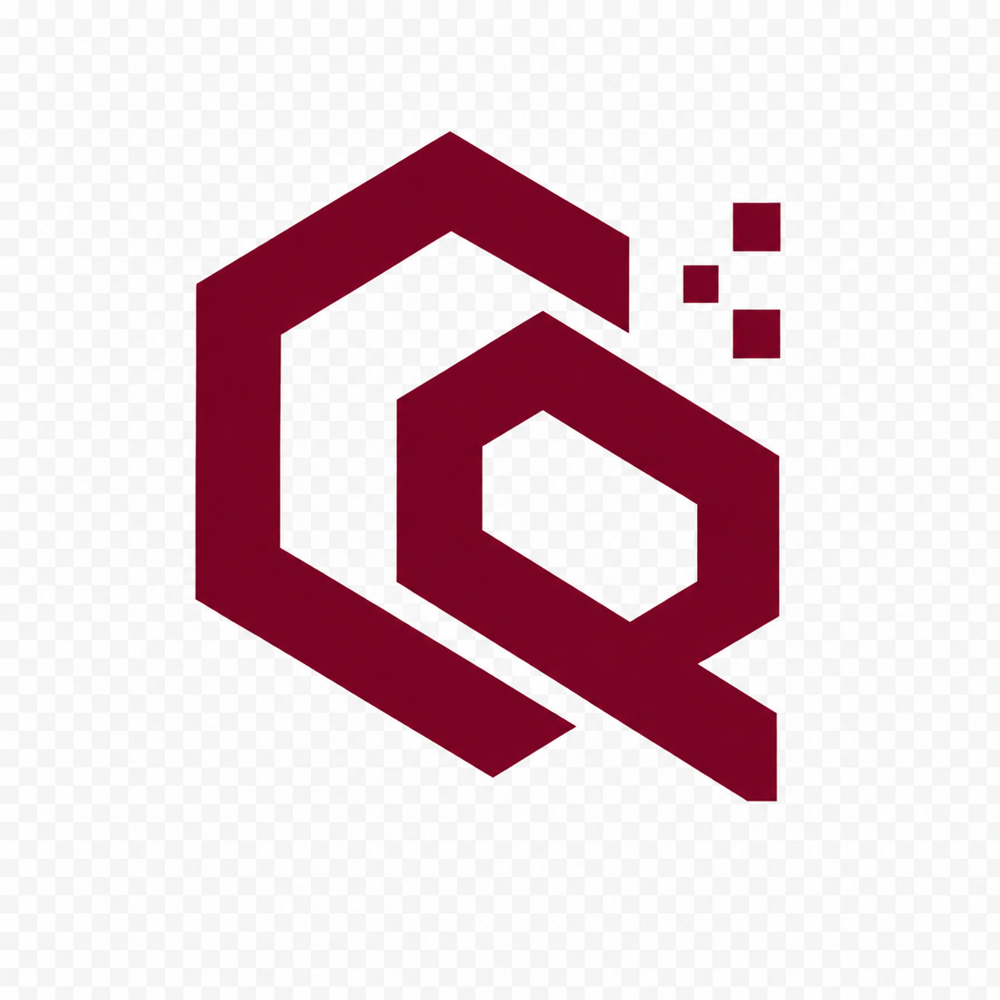

<div align="center">
  

# RizQara Tech

### Build Smart. Grow Fast.

**Websites • Web Applications • SaaS • POS • Automation • SEO • Branding • Digital Growth**

[](https://www.rizqara.tech)
[](mailto:rizqaratech@gmail.com)
[](#)

</div>

---

## About RizQara Tech

**RizQara Tech** is a Bangladesh-based software and digital solutions company focused on helping modern businesses build a stronger digital presence, automate operations, and grow online.

We build business-focused digital products for shops, restaurants, salons, clinics, educational brands, e-commerce businesses, startups, and growing companies.

Our goal is simple:

> **We do not just build websites. We build digital systems that help businesses work smarter and grow faster.**

---

## What We Build

| Solution | What It Helps With |
|---|---|
| **Business Websites** | Professional online presence, trust, services, contact flow |
| **Web Applications** | Custom tools, dashboards, portals, user systems |
| **SaaS Platforms** | Scalable subscription-based software products |
| **E-commerce Systems** | Product selling, checkout, orders, customer experience |
| **POS & Inventory Systems** | Billing, stock, sales reports, business management |
| **Restaurant QR Systems** | Digital menu, QR ordering, table/order management |
| **Automation Tools** | Lead management, follow-up, workflow automation |
| **SEO Systems** | Google visibility, technical SEO, local SEO growth |
| **Branding & UI Design** | Visual identity, landing pages, social content systems |
| **Digital Marketing Support** | Content, campaigns, ads, funnels, growth strategy |

---

## Our Working Process

```text
Audit → Plan → Demo → Payment → Build → Review → Launch → Support
```

### 1. Audit
We understand the business, current online presence, digital gaps, customer journey, and project goals.

### 2. Plan
We prepare a practical solution roadmap based on budget, business type, and required features.

### 3. Demo
We show a concept, preview, structure, or visual direction before full execution whenever possible.

### 4. Payment
We follow milestone-based payments to keep the process safe, clear, and professional.

### 5. Build
Our team designs and develops the approved solution using reliable and scalable technologies.

### 6. Review
We collect feedback, refine details, and improve the project before final delivery.

### 7. Launch
We deploy the project professionally and ensure key features work properly.

### 8. Support
We provide post-launch support based on the agreed scope and support period.

---

## Core Technology Stack

### Frontend


### Backend


### Database & Cloud


---

## Featured Product Directions

| Project / Product | Category | Status |
|---|---|---|
| **RizQara Tech Website** | Company Website | Live |
| **RizQara Search** | Smart Search System | Demo / Product Direction |
| **RizQara Solution** | POS & Business Management | Product Direction |
| **RizQara Restaurant** | QR Ordering + Restaurant System | Demo / Product Direction |
| **RizQara Shop** | E-commerce Platform | Demo / Product Direction |
| **WhatsApp Automation System** | Marketing Automation Tool | Internal / Product Direction |
| **Doctor Portfolio System** | Healthcare Digital Profile | Demo Direction |
| **Salon Booking System** | Appointment Booking | Demo Direction |

---

## Repository Categories

### Public Demo Repositories
These repositories show our design quality, solution structure, and technical direction.

### Product Repositories
These are used for RizQara-owned platforms, SaaS products, dashboards, and automation tools.

### Private Client Repositories
Client projects, private business logic, credentials, and confidential data are never published publicly.

---

## Professional Standards

We follow:

- Clean project structure
- Secure environment variable handling
- Clear README documentation
- Responsive UI principles
- Scalable architecture planning
- Basic SEO and performance practices
- Professional agreement and milestone process
- Client-first communication

---

## Contact RizQara Tech

**Website:** https://www.rizqara.tech  
**Email:** rizqaratech@gmail.com  
**Phone:** 01343042761  
**Location:** Dhaka, Bangladesh  

---

<div align="center">

### RizQara Tech

**Build Smart. Grow Fast.**

</div>
